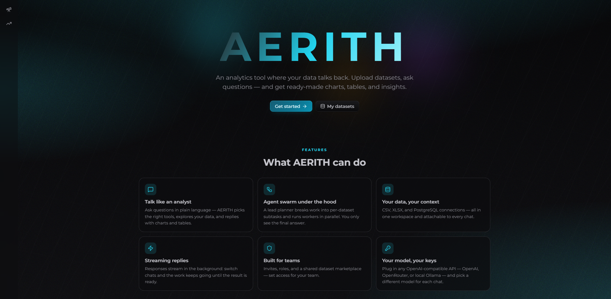
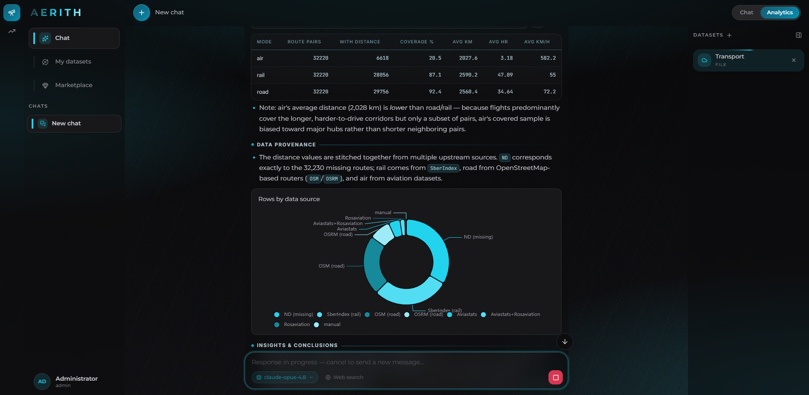
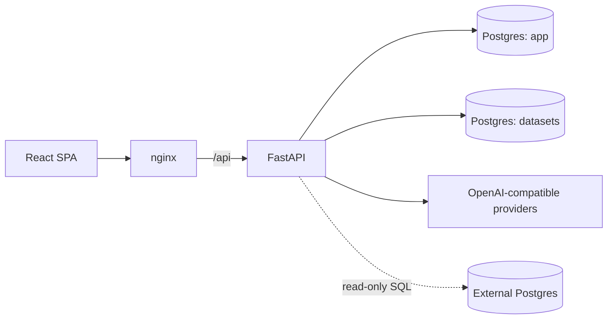

# AERITH

AI analytics workspace. Chat with any OpenAI-compatible LLM, connect your data
(CSV/XLSX uploads or external Postgres), and let a swarm of SQL agents answer
analytical questions with live charts and tables — all self-hosted.

> **Early stage.** AERITH is under active development — features, UI, and docs
> will evolve gradually. Feedback and contributions are welcome.

<p align="center">
  
</p>

## Features

- **Chat** — streaming responses (SSE), optional web search, automatic chat titles.
- **Analytics mode** — link datasets to a chat; a planner splits the question,
  parallel sub-agents run read-only SQL against each source, and a lead agent
  merges the results into one answer with inline charts.
- **Bring your own model** — every user can register any OpenAI-compatible
  provider (OpenAI, OpenRouter, local vLLM/Ollama, …) with their own base URL
  and API key, keep several of them, and switch models per chat.
- **Datasets** — upload CSV/XLSX (stored in a dedicated Postgres) or connect an
  external Postgres (credentials encrypted at rest); share datasets through the
  built-in marketplace.
- **Auth & admin** — JWT cookie sessions, refresh tokens, invite-based
  registration, admin panel.

<p align="center">
  
</p>

## Quickstart (Docker)

```bash
git clone <repo-url> aerith && cd aerith
cp .env.example .env
# edit .env: set DB passwords and AUTH__JWT_SECRET (openssl rand -hex 32)
docker compose up --build
```

Open http://localhost:8888 and log in with the seed admin (`admin` / `admin`
by default — change it immediately). Add an AI provider in
**Settings → AI providers**, or configure a server-wide fallback via `LLM__*`
variables in `.env`.

## Configuration

All settings are environment variables with the `SECTION__KEY` naming
convention (see [.env.example](.env.example) for the full annotated list).

Required:

| Variable | Purpose |
|---|---|
| `DB__NAME` / `DB__USER` / `DB__PASSWORD` | Application Postgres |
| `DATASETS__DB__NAME` / `DATASETS__DB__USER` / `DATASETS__DB__PASSWORD` | Datasets Postgres |
| `AUTH__JWT_SECRET` | JWT signing secret (`openssl rand -hex 32`) |

Everything else is optional and documented in `.env.example`, including the
server-wide fallback LLM provider (`LLM__API_KEY`, `LLM__BASE_URL`,
`LLM__DEFAULT_MODEL`), dataset limits, cookie policy, CORS and web search.

## Architecture



- `src/aerith/` — FastAPI backend: routers, services (chat runtime, analytics
  swarm, LLM resolver), SQLAlchemy models, Alembic migrations.
- `frontend/` — React 19 + Vite + Tailwind SPA; charts rendered with ECharts.
- Model resolution per chat: chat's provider → user's default provider →
  server-wide `LLM__*` fallback.

## Extending AERITH

See [docs/INTEGRATION.md](docs/INTEGRATION.md) for how to:

- plug in your own OpenAI-compatible API,
- connect your own data sources,
- add a new workspace module.

## License

[MIT](LICENSE)
